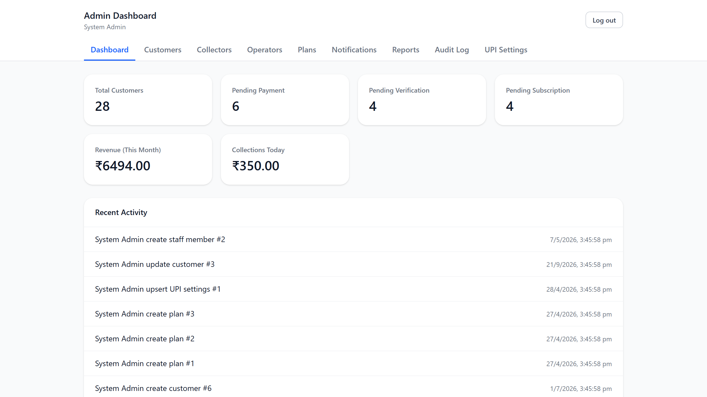
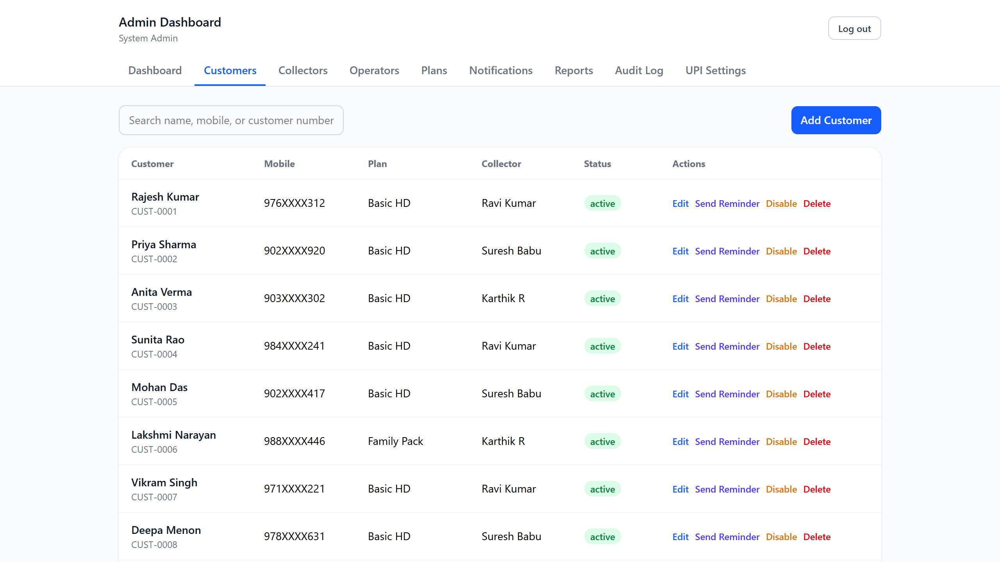
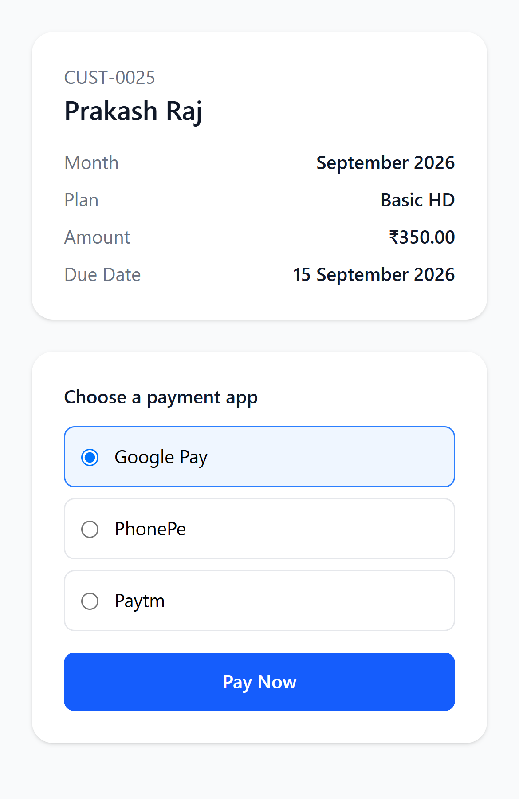
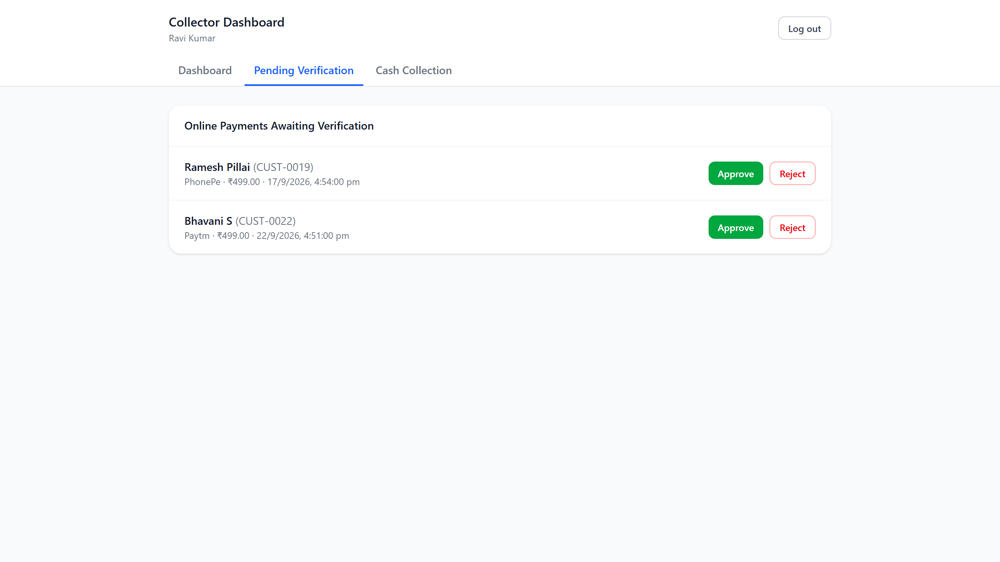
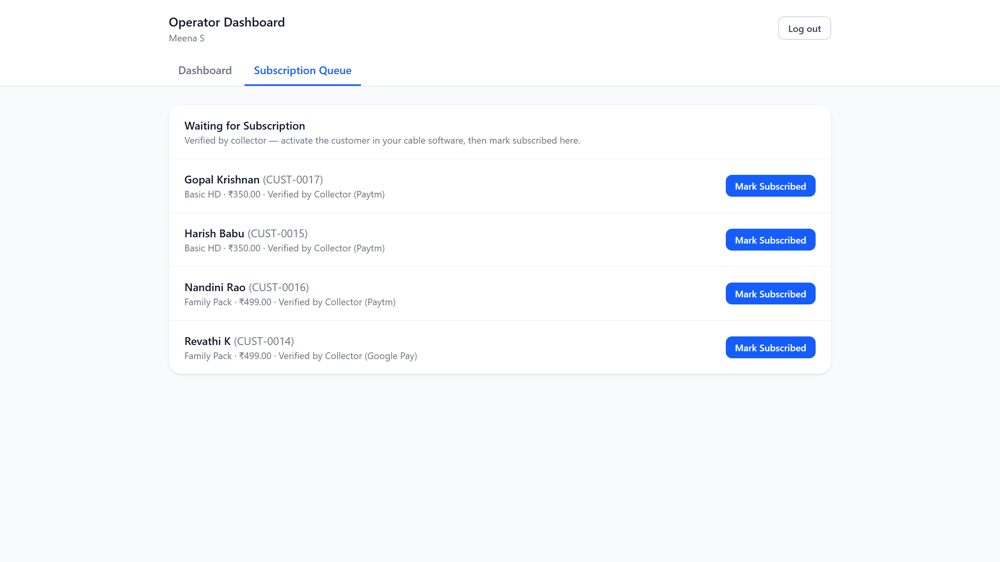
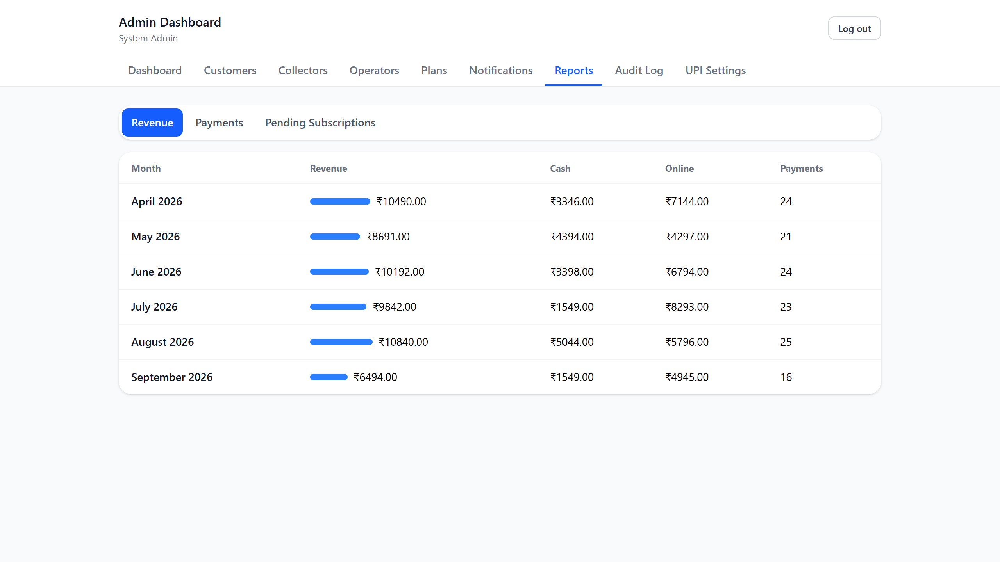

# Local-Cable-Subscription-Reminder
Local Cable Subscription Reminder & Payment Management System

A web app for local cable TV operators to send monthly payment reminders (SMS/WhatsApp), collect
UPI/cash payments, and track the full subscription lifecycle across four roles: Customer,
Collector, Operator, and Admin.

## Screenshots

*Screenshots use demo data; phone numbers are masked.*

**Admin dashboard** — live customer counts, pending payments, and revenue



**Customer management** — plans, collectors, and one-click payment reminders



**Customer payment page** — opened from the SMS link, no login needed



**Collector** — verify UPI payments customers have submitted



**Operator** — activate verified customers and mark them subscribed



**Reports** — monthly revenue, cash vs online



## Run everything with one command (Docker)

Requires Docker Desktop.

```bash
cp backend/.env.example backend/.env   # then edit backend/.env with real secrets
docker compose --env-file backend/.env up -d --build
```

This builds and starts three containers:
- **db** — PostgreSQL, data persisted in a named volume
- **backend** — FastAPI, runs migrations automatically on startup
- **frontend** — the React app served by Nginx, which also reverse-proxies `/api/*` to the backend

Open **http://localhost:8080** — that one URL serves the whole app (customer payment pages, and
`/login` for Collector/Operator/Admin). The backend is also reachable directly at
`http://localhost:8001` if needed.

Seed an admin account (first time only):

```bash
docker compose --env-file backend/.env exec backend python -m app.seed
```

To stop everything: `docker compose --env-file backend/.env down` (add `-v` to also delete the
database volume — don't do this unless you mean to wipe all data).

## Deploying to a real VPS

1. Copy the repo to the server, set up `backend/.env` with real production secrets (a fresh
   `JWT_SECRET_KEY`, a strong Postgres password, and your Fast2SMS key if you have one).
2. Set `DEPLOYED_BASE_URL` in `backend/.env` to your actual domain (e.g. `https://cable.example.com`)
   — this is what gets embedded in customers' SMS/WhatsApp payment links.
3. Run the same `docker compose --env-file backend/.env up -d --build` command on the server.
4. Put a real reverse proxy (Caddy, or Nginx with certbot) in front of port 8080 to terminate
   HTTPS and forward to it — the app itself doesn't handle TLS.
5. Point your domain's DNS at the server and you're live.

## Local development (without Docker, for active coding)

See [backend/README.md](backend/README.md) and [frontend/README.md](frontend/README.md) for
running the backend and frontend directly on your machine with hot-reload. You'll still want
Postgres running via `docker compose --env-file backend/.env up -d db` for that.

## Project structure

```
backend/    FastAPI application (all API code)
frontend/   React + Vite application (all UI code)
docker-compose.yml   Full-stack orchestration (db + backend + frontend/nginx)
```
